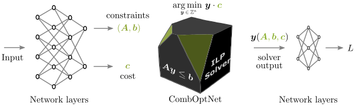

# CombOptNet: Fit the Right NP-Hard Problem by Learning Integer Programming Constraints




This repository contains PyTorch implementation of the paper
[CombOptNet: Fit the Right NP-Hard Problem by Learning Integer Programming Constraints](https://arxiv.org/abs/2105.02343)

## Installation
1) Run `pipenv install` (at your own risk with `--skip-lock` to save some time).
2) From within the pipenv environment run `python3 -m pip install -i https://pypi.gurobi.com gurobipy`.
3) Obtain a [license](https://www.gurobi.com/documentation/9.1/quickstart_mac/obtaining_a_grb_license.html) and download/set it.
4) Download and extract the [datasets](https://edmond.mpdl.mpg.de/imeji/collection/Z_abYaB4ggQTS_G0?q=).

## Usage
For `[experiment] = knapsack` or `[experiment] = static_constraints`:
1) Set the `base_dataset_path` parameter in `experiments/[experiment]/base.yaml`.
2) In case of static constraints: set the `dataset_specification` parameter in `experiments/static_constraints/base.yaml`
3) Run `python3 main.py experiments/[experiment]/[method].yaml`.

## Citation

```
@misc{paulus2021comboptnet,
      title={CombOptNet: Fit the Right NP-Hard Problem by Learning Integer Programming Constraints}, 
      author={Anselm Paulus and Michal Rolínek and Vít Musil and Brandon Amos and Georg Martius},
      year={2021},
      eprint={2105.02343},
      archivePrefix={arXiv},
      primaryClass={cs.LG}
}
```